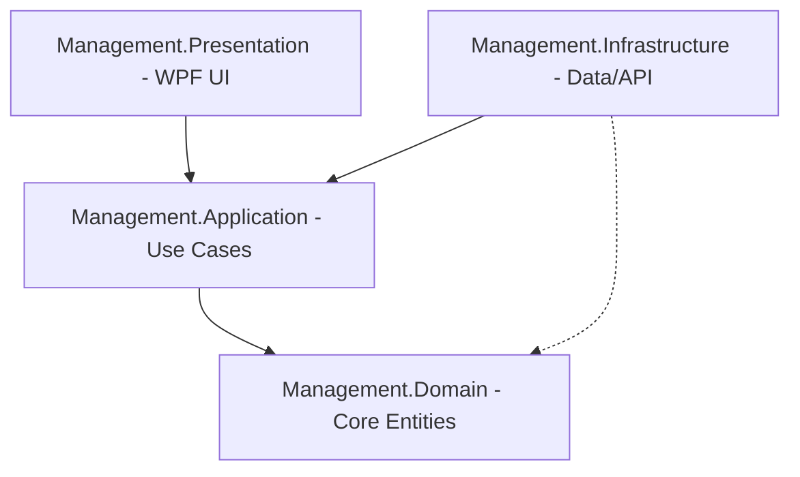

# Architecture Documentation - Management System

This document provides a comprehensive overview of the **Management** project architecture, design patterns, and implementation details.

## 📖 Table of Contents
1. [Project Overview](#1-project-overview)
2. [Architecture Pattern](#2-architecture-pattern)
3. [Folder Structure](#3-folder-structure)
4. [Cross-Cutting Concerns](#4-cross-cutting-concerns)
5. [Key Design Decisions](#5-key-design-decisions)
6. [Data Flow Examples](#6-data-flow-examples)
7. [External Dependencies](#7-external-dependencies)
8. [Database Schema](#8-database-schema)
9. [Configuration](#9-configuration)
10. [Build & Deployment](#10-build--deployment)
11. [Known Issues & Limitations](#11-known-issues--limitations)
12. [Future Roadmap](#12-future-roadmap)

---

## 1. Project Overview

**Purpose:**
The Management System is a centralized, multi-tenant facility management platform designed to streamline operations for various business types including gyms, salons, and restaurants. It provides a unified interface for member registration, access control, point-of-sale (POS), appointment scheduling, and financial reporting, while maintaining high performance on desktop hardware.

**Business Domain:**
- **Gym Management:** Access control (turnstiles), membership plans, and session tracking.
- **Salon Management:** Stylist scheduling, appointment booking, and service management.
- **Restaurant Management:** Floor plan management, table ordering, and POS flow.
- **Multi-Facility License System:** A hierarchy allowing owners to manage multiple facilities under a single license.

**Target Users:**
- **Owner:** Full visibility across all facilities and financial health.
- **Staff:** Role-based access (Trainers, Stylists, Waiters) restricted to specific facility functions.

---

## 2. Architecture Pattern

**Pattern Used:** Clean Architecture + Domain-Driven Design (DDD) + CQRS

**Explain:**
The project follows **Clean Architecture** to ensure that the core business logic remains independent of external frameworks, databases, or UI. This is achieved by separating the code into four distinct layers where dependencies flow inward toward the **Domain**.

**Diagram:**


**Flow of Dependencies:**
- **Presentation → Application:** The UI sends commands/queries to the application layer via MediatR.
- **Application → Domain:** Use cases interact with domain entities and aggregate roots to execute business logic.
- **Infrastructure → Domain:** Repositories implement domain interfaces to persist data.
- **Infrastructure → Application:** Infrastructure provides implementations for application-level services (e.g., Auth, Storage).

---

## 3. Folder Structure

### Management.Domain/
*Core business logic and enterprise rules. Zero dependencies on external libraries.*
- **Entities/**: Persistent objects with unique identities (e.g., `Member`, `Product`).
- **Models/**: Domain models categorized by business area (Gym, Salon, Restaurant).
- **Enums/**: Domain-specific types (e.g., `StaffRole`, `MemberStatus`).
- **Interfaces/**: Contracts for repositories and services implemented in Infrastructure.
- **ValueObjects/**: Objects defined by attributes rather than identity (e.g., `Money`).
- **Common/**: Base classes like `AggregateRoot`, `Entity`, and `Result` pattern wrapper.

### Management.Application/
*Use cases and CQRS logic. Orchestrates flow between Domain and Infrastructure.*
- **Features/**: Grouped by business domain, containing:
    - **Commands/**: Handlers for state-changing operations (e.g., `CreateMember`).
    - **Queries/**: Handlers for data retrieval (e.g., `GetDashboardStats`).
- **DTOs/**: Data Transfer Objects used to pass data between layers.
- **Behaviors/**: Cross-cutting MediatR pipeline behaviors (e.g., `PerformanceBehavior`).
- **Interfaces/**: Contracts for high-level application services.

### Management.Infrastructure/
*Concrete implementations of interfaces. Handles database, API, and hardware.*
- **Data/**: EF Core `AppDbContext`, Migrations, and SQLite configuration (WAL mode).
- **Repositories/**: Implementations of Domain interfaces using Entity Framework or Supabase.
- **Services/**: Integration services (e.g., `SupabaseProvider`, `AuthenticationService`).
- **Hardware/**: Drivers for ESC/POS printers, RFID readers, and turnstiles.
- **Workers/**: Background tasks (e.g., `SyncWorker` for cloud sync).

### Management.Presentation/
*WPF UI following MVVM. Responsible for user interaction and aesthetics.*
- **Views/**: XAML files defining the "Apple Spatial" inspired UI.
- **ViewModels/**: Logic for views, inheriting from `ViewModelBase` for standard busy/error states.
- **Resources/**: Theming (Glassmorphism), dynamic tokens, and styles.
- **Services/**: UI-specific services (e.g., `NavigationService`, `ThemeService`).

---

## 4. Cross-Cutting Concerns

**Logging:**
- **Configuration:** Initialized in `App.xaml.cs` using the .NET Generic Host.
- **Library:** `Microsoft.Extensions.Logging` with `Serilog` (configured for Console, Debug, and File).
- **Usage:** Inject `ILogger<T>` into any class constructor.

**Error Handling:**
- **Global:** Centralized in `App.xaml.cs` (UnhandledException, DispatcherUnhandledException).
- **ViewModel:** `ExecuteSafeAsync` in `ViewModelBase` wraps calls in try-catch and updates `HasError`/`ErrorMessage` properties.
- **Diagnostics:** `IDiagnosticService` tracks fatal crashes to local JSON files in `AppData`.

**Validation:**
- **Mechanism:** FluentValidation is used within MediatR pipelines.
- **Location:** `Management.Application/Features/[Feature]/Commands/[Command]Validator.cs`.
- **Client-Side:** Reactive validation in ViewModels (coming soon).

**Security:**
- **Cloud:** Supabase Auth for user authentication and Row Level Security (RLS) on tables.
- **Local:** `SecurityService` handles encryption for local credentials.
- **Database:** UUID v7 (Time-Ordered) for all primary keys to prevent fragmentation and information leakage.

**Performance:**
- **Database:** SQLite is configured with **WAL (Write-Ahead Logging)** to prevent "Database is locked" errors during heavy sync.
- **UI:** Virtualization is enabled for all large lists (Members, Transactions).
- **Backgrounding:** All heavy I/O is handled via `async/await` and non-blocking `SyncWorker`.

---

## 5. KEY DESIGN DECISIONS

**Decision 1: CQRS with MediatR**
- **What:** Separating "Writes" (Commands) from "Reads" (Queries).
- **Why:** Simplifies the application layer by making handler classes focused on a single task. Enables easy injection of cross-cutting concerns (logging, performance tracking) through pipelines.
- **Trade-offs:** More classes/files (boilerplate), but significantly better maintainability.

**Decision 2: Supabase for backend**
- **What:** Using Supabase (PostgreSQL + Auth + Realtime) as the primary cloud data store.
- **Why:** Extremely fast development of Auth and RLS. Built-in Realtime support for multi-device sync.
- **Alternative:** Custom ASP.NET Core API + SQL Server.
- **Trade-offs:** Dependency on a 3rd party provider.

**Decision 3: SQLite for Local Resilience**
- **What:** Local SQLite database mirroring essential cloud data.
- **Why:** Allows "Offline-First" operations. The app remains functional (Check-in/Sales) even if the internet drops.
- **Trade-offs:** Complexity in synchronization (Sync Engine).

---

## 6. DATA FLOW EXAMPLES

### Example 1: User Creates a New Member
1. User clicks "Save" in **MemberAddView.xaml**
2. **MembersViewModel.cs** executes `AddMemberCommand` via `ExecuteSafeAsync`.
3. MediatR sends **CreateMemberCommand** and invokes `CreateMemberCommandHandler`.
4. Handler uses **IMemberRepository** to save the new `Member` entity.
5. **MemberRepository.cs** persists to the local SQLite DB and initiates a background push to **Supabase**.
6. UI updates via the `ObservableCollection` in the ViewModel.

### Example 2: User Login
1. User enters credentials in **LoginView.xaml**.
2. **AuthenticationService.cs** calls `Supabase.Auth.SignIn`.
3. If successful, **SessionManager** persists the token and rehydrates the **StaffMember** entity.
4. **NavigationService** switches the shell view to the Dashboard.

### Example 3: Theme Switching
1. User selects "Restaurant Mode" in Settings.
2. **ThemeService.cs** identifies the requested theme variant.
3. `Application.Current.Resources.MergedDictionaries` are cleared and reloaded with `Restaurant.xaml`.
4. The entire UI updates instantly via DynamicResource bindings.

### Example 4: Payment Processing
1. User confirms a sale in the POS.
2. **ProcessPaymentCommandHandler.cs** validates the transaction total.
3. **FinanceService.cs** interacts with the local DB to create a `Sale` record.
4. An `OutboxMessage` is created for background synchronization to the cloud.

### Example 5: Appointment Booking
1. User drags a slot in **SalonSchedulerView.xaml**.
2. **BookAppointmentCommand** is dispatched with employee and time parameters.
3. The handler checks for conflicts (Double-booking) in the **AppointmentService**.
4. Confirmation is sent to the user, and the UI slot turns from transparent to brand-tinted glass.

---

## 7. EXTERNAL DEPENDENCIES

| Package | Version | Purpose | Used In | Critical |
| :--- | :--- | :--- | :--- | :--- |
| **CommunityToolkit.Mvvm** | 8.3 &uarr; | Source generators for `ObservableProperty` and `RelayCommand`. | Presentation | YES |
| **MediatR** | 12.4 | Implementation of CQRS pattern. | Application | YES |
| **Supabase** | 1.0 | Cloud backend, Auth, and Database integration. | Infrastructure | YES |
| **Microsoft.EntityFrameworkCore** | 8.0 | ORM for local SQLite caching. | Infrastructure | YES |
| **Serilog** | 4.3 | Structured logging to files and console. | Infrastructure | NO |
| **Polly** | 8.4 | Resilience and transient-fault-handling (Retries). | Infrastructure | YES |

---

## 8. DATABASE SCHEMA (Supabase/Postgres)

### Table: members
- **Purpose**: Stores all facility members and their metadata.
- **RLS Policies**: `tenant_id` check enforced.
- **Columns**:
    - `id` (uuid, PK): Time-ordered UUID.
    - `full_name` (text): Full legal name.
    - `email` (text): Unique email address.
    - `card_id` (text): RFID/Barcode identifier.
    - `status` (int): 0=Active, 1=Suspended, 2=Expired.

### Table: sales
- **Purpose**: Financial transactions for products and services.
- **Relationships**: `member_id` &rarr; `members.id`.
- **Columns**:
    - `total_amount` (decimal): Total including tax.
    - `payment_method` (text): Cash, Card, or Member Balance.

---

## 9. CONFIGURATION

**App Settings (`appsettings.json`):**
- **Supabase Section**: Contains `Url` and `Key`.
- **ConnectionStrings**: Local SQLite and Supabase Postgres direct strings.

**Environment Variables:**
- Uses standard .NET environments: `Development`, `Staging`, `Production`.

**Secrets Management:**
- API keys are excluded from source control and managed via `dotnet user-secrets` during development.

---

## 10. BUILD & DEPLOYMENT

### How to build:
```powershell
# Restore dependencies
dotnet restore

# Build the solution in Release mode
dotnet build Management.sln -c Release
```

### How to run:
```powershell
# Navigate to the presentation folder
cd Management.Presentation
dotnet run
```

### How to test:
```powershell
# Run all unit and integration tests
dotnet test
```

---

## 11. KNOWN ISSUES & LIMITATIONS

1. **Local Disconnect Loop:** In rare cases, the Sync Engine might attempt to sync before the network is fully stabilized.
2. **WPF Limitations:** Animations may stutter on extremely low-end hardware if "Potato Mode" is not enabled.
3. **Windows-Only:** The use of `System.Management` and WPF restricts this application to Windows 10/11.

---

## 12. FUTURE ROADMAP

- **Planned Features:**
    - AI-Driven attendance forecasting.
    - Mobile app for member check-ins.
- **Technical Improvements:**
    - Migration to .NET 9 for native UUID v7 support.
    - Implementation of Event Sourcing for financial audit trails.
