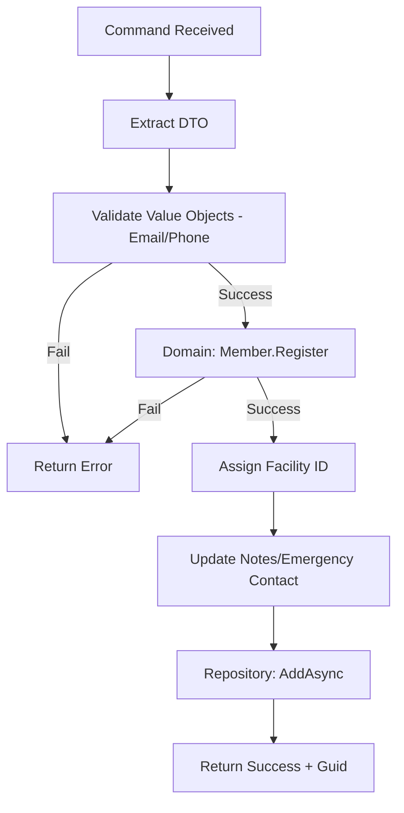

# File Documentation: CreateMemberCommandHandler.cs

Act as a Code Reviewer explaining code to a junior developer.

## 📋 DELIVERABLE: FILE_DOCUMENTATION.md

### 1. FILE HEADER

**File Path:** `Management.Application/Features/Members/Commands/CreateMember/CreateMemberCommandHandler.cs`
**Namespace:** `Management.Application.Features.Members.Commands.CreateMember`
**Layer:** Application Layer
**Purpose:** Handles the logic for creating a new member by validating input, creating a Domain entity, and persisting it to the repository.

---

### 2. DEPENDENCIES

**Using Statements:**
- `using Management.Domain.Interfaces;`
  - **Why:** Access to the repository and service interfaces (e.g., `IMemberRepository`).
  - **Used in:** Line 15, 19 (dependency injection fields and constructor).
- `using Management.Domain.Models;`
  - **Why:** Access to the `Member` aggregate root.
  - **Used in:** Line 36 (instantiating the member).
- `using Management.Domain.Common;`
  - **Why:** Access to the `Result<T>` wrapper class for standardized return values.
  - **Used in:** Line 13, 26 (method return types).
- `using Management.Domain.ValueObjects;`
  - **Why:** Access to `Email` and `PhoneNumber` value objects for strong-typed validation.
  - **Used in:** Line 30, 31 (validation logic).
- `using MediatR;`
  - **Why:** Standard library for the Mediator pattern, providing the `IRequestHandler` interface.
  - **Used in:** Line 13 (interface implementation).
- `using Management.Application.DTOs;`
  - **Why:** Access to `MemberDto` which carries the raw data from the UI.
  - **Used in:** Line 28 (extracting data from the request).

**Injected Dependencies:**
- `private readonly IMemberRepository _memberRepository;`
  - **Why injected:** Data persistence is an infrastructure concern; the handler only needs the interface to save data.
  - **When it's called:** Line 77 (`AddAsync`).
  - **Could it be null?** NO - enforced by dependency injection at runtime.
- `private readonly Domain.Services.ITenantService _tenantService;`
  - **Why injected:** To determine which facility (tenant) the member belongs to in a multi-facility environment.
  - **When it's called:** Line 51 (`GetTenantId`).

---

### 3. CLASS/INTERFACE DECLARATION

**Full Declaration:**
```csharp
public class CreateMemberCommandHandler : IRequestHandler<CreateMemberCommand, Result<Guid>>
```

**Explanation:**
- `public`: Allows the Mediator to find and instantiate this handler from other projects.
- `class`: A standard reference type to hold the handling logic.
- `CreateMemberCommandHandler`: Follows the convention `[Action][Entity]Handler`.
- `: IRequestHandler<...>`: Implements the MediatR contract to handle a specific request.
- `<CreateMemberCommand, Result<Guid>>`: Defines that this class handles the `CreateMemberCommand` and returns a `Result` containing the new member's `Guid`.

**Design Pattern:**
- **Pattern name:** Command Handler Pattern (part of CQRS).
- **Why this pattern?** It separates the "intent" (Command) from the "execution" (Handler), making the code testable and easy to follow.
- **Alternative approaches?** Putting logic directly in controllers or services, which often leads to "fat" classes that are hard to maintain.

---

### 4. PROPERTIES & FIELDS

*Note: This class uses fields for dependency immersion rather than properties.*

- `private readonly IMemberRepository _memberRepository;`
  - **Explanation:** A private, read-only field to store the repository instance. The underscore prefix is a standard convention for private fields.
- `private readonly ITenantService _tenantService;`
  - **Explanation:** Stores the service used to fetch the current facility ID.

---

### 5. METHODS - LINE BY LINE

**Method: Handle**

```csharp
public async Task<Result<Guid>> Handle(CreateMemberCommand request, CancellationToken cancellationToken)
{
    // Line 28: Extract the DTO from the command.
    var dto = request.Member;

    // Line 30-31: Convert raw strings into Value Objects.
    var emailResult = Email.Create(dto.Email);
    var phoneResult = PhoneNumber.Create(dto.PhoneNumber);
    
    // Line 33-34: Business Rule Validation.
    // Why: If the email or phone is invalid, we stop immediately.
    if (emailResult.IsFailure) return Result.Failure<Guid>(emailResult.Error);
    if (phoneResult.IsFailure) return Result.Failure<Guid>(phoneResult.Error);

    // Line 36-42: Domain Logic - Registering the Member.
    // Why: We use a static factory method on the Member class to ensure a valid initial state.
    var result = Member.Register(
        dto.FullName,
        emailResult.Value.Value,
        phoneResult.Value.Value,
        dto.CardId,
        dto.ProfileImageUrl,
        dto.MembershipPlanId);

    // Line 44-47: Handle Domain creation failure.
    if (result.IsFailure)
    {
        return Result.Failure<Guid>(result.Error);
    }

    // Line 49: Extract the valid Member entity.
    var member = result.Value;
    
    // Line 51-55: Multi-Tenancy Assignment.
    // Why: Ensures the member is tagged to the correct facility.
    var facilityId = _tenantService.GetTenantId();
    if (facilityId.HasValue)
    {
        member.FacilityId = facilityId.Value;
    }

    // Line 57-66: Optional Data Updates.
    // Why: If notes are provided, update the entity.
    if (!string.IsNullOrEmpty(dto.Notes)) 
    {
        member.UpdateDetails(..., dto.Notes);
    }

    // Line 68-75: Optional Emergency Contact.
    // Why: Strong-typed validation for optional phone numbers.
    if (!string.IsNullOrEmpty(dto.EmergencyContactName) && !string.IsNullOrEmpty(dto.EmergencyContactPhone))
    {
        var emerPhone = PhoneNumber.Create(dto.EmergencyContactPhone);
        if (emerPhone.IsSuccess)
        {
            member.UpdateEmergencyContact(dto.EmergencyContactName, emerPhone.Value.Value);
        }
    }
    
    // Line 77: Persistence.
    // Why: Actually save the member to the database (Infrastructure call).
    await _memberRepository.AddAsync(member);

    // Line 79: Success Return.
    // Returns: The ID of the newly created member.
    return Result.Success(member.Id);
}
```

**Method Flow Diagram:**


---

### 6. EDGE CASES HANDLED

1. **Invalid Email Format:**
   - Line: 30
   - How handled: `Email.Create` uses regex; handler returns `Result.Failure`.
2. **Invalid Phone Format:**
   - Line: 31
   - How handled: `PhoneNumber.Create` validates international formats.
3. **Missing Facility ID:**
   - Line: 51
   - How handled: Checked via `HasValue`; if missing, it simply proceeds (defensive check).
4. **Invalid Emergency Contact Phone:**
   - Line: 71
   - How handled: Only updates if `emerPhone.IsSuccess` is true; otherwise, it skips just that field to prevent a crash.

---

### 7. TESTING STRATEGY

**Unit Test Example:**
```csharp
[Fact]
public async Task Handle_ValidRequest_ReturnsSuccess()
{
    // Arrange
    var mockRepo = new Mock<IMemberRepository>();
    var mockTenant = new Mock<ITenantService>();
    var handler = new CreateMemberCommandHandler(mockRepo.Object, mockTenant.Object);
    var command = new CreateMemberCommand(new MemberDto { Email = "valid@test.com", ... });

    // Act
    var result = await handler.Handle(command, CancellationToken.None);

    // Assert
    Assert.True(result.IsSuccess);
    mockRepo.Verify(r => r.AddAsync(It.IsAny<Member>()), Times.Once);
}
```

---

### 8. POTENTIAL ISSUES

1. **Email Uniqueness:**
   - **Issue:** The handler doesn't check if the email already exists before registration.
   - **Priority:** High.
2. **Transaction Management:**
   - **Issue:** If `AddAsync` succeeds but a subsequent side-effect fails, there's no rollback.
   - **Priority:** Medium.

---

### 9. RELATED FILES

**This file depends on:**
1. `CreateMemberCommand.cs`: Defines the input structure.
2. `IMemberRepository.cs`: The persistence contract.
3. `Member.cs`: The domain entity logic.

**Files that depend on this:**
1. `MembersViewModel.cs`: Triggers this handler when a user clicks "Save".
