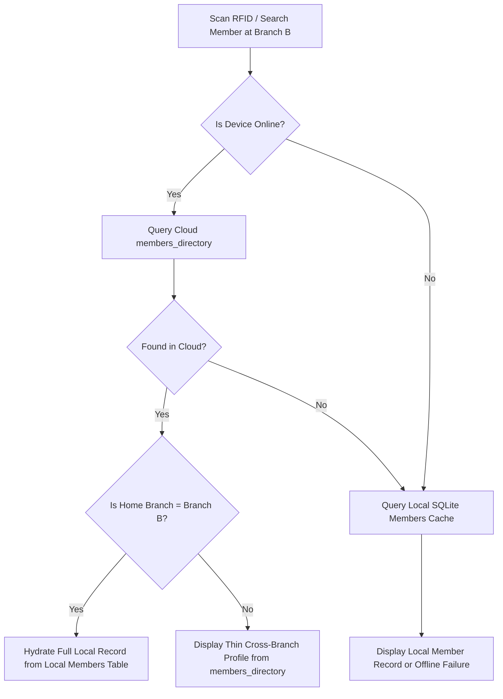

# Schema Migration Plan
## New Supabase Project — Account / Subscription / License / Facility Template Layer

> [!IMPORTANT]
> This document covers Steps 1–5 of the analysis as requested. No SQL has been written. Approval is required before any migration files are generated or any existing code is touched.

---

## Step 1 — Existing Codebase Inventory

### 1A — Supabase Tables Currently in Use

The following tables are defined in `SupabaseModels.cs` and actively queried. No RLS SQL was found in the codebase — all policies are assumed to live server-side in the existing Supabase project.

---

**`profiles`**
- `id` (uuid, PK) — mirrors `auth.users.id`
- `tenant_id` (uuid, nullable FK → tenants)
- `supabase_user_id` (uuid, nullable)
- `full_name` (text)
- `role` (int)
- `permissions` (jsonb)
- `allowed_modules` (jsonb)
- `created_at` (timestamptz)
- *Used in:* `OnboardingService` (signup polling), `AuthenticationService` (indirect)

---

**`tenants`**
- `id` (uuid, PK)
- `name` (text)
- `slug` (text)
- `industry` (text) — currently a free-text field (e.g. "Gym")
- `status` (text) — "active" default
- `created_at` (timestamptz)
- *Used in:* `OnboardingService.ValidateLicenseAsync`, `UpdateTenantIndustryAsync`, `RegisterBusinessAsync`

---

**`facilities`**
- `id` (uuid, PK)
- `tenant_id` (uuid, FK → tenants)
- `name` (text)
- `description` (text)
- `slug` (text)
- `type` (int) — hardcoded enum: 0=General, 1=Gym, 2=Pool, 3=Sauna, 4=Studio, 5=Salon, 6=Restaurant, 99=Admin, 100=LadiesOnly
- `is_active` (bool)
- `created_at` (timestamptz)
- *Used in:* `OnboardingService.ValidateLicenseAsync` (queried directly), `ProvisionFacilityAsync` (created via RPC `fn_provision_facility`), `RegisterBusinessAsync` (3 facilities eagerly provisioned on registration: Gym, Salon, Restaurant)
- *Also in local SQLite:* `AppDbContext.Facilities`

---

**`licenses`**
- `id` (uuid, PK)
- `license_key` (text)
- `tenant_id` (uuid, nullable FK → tenants)
- `max_devices` (int)
- `expires_at` (timestamptz)
- `is_active` (bool)
- `created_at` (timestamptz)
- *Used in:* RPC `verify_license_key` (not direct table access from C#)

---

**`tenant_devices`**
- `id` (uuid, PK)
- `tenant_id` (uuid, FK → tenants)
- `license_id` (uuid, nullable FK → licenses)
- `hardware_id` (text)
- `label` (text)
- `registered_at` (timestamptz)
- *Used in:* `OnboardingService.GetDevicesAsync`, `GetDeviceCountAsync`, `RevokeDeviceAsync` (via RPC `revoke_device`), `VerifyCurrentDeviceAsync` (via RPC `check_device_activation`)

---

**`staff_members`**
- `id` (uuid, PK)
- `tenant_id` (uuid, FK → tenants)
- `facility_id` (uuid, FK → facilities)
- `full_name` (text)
- `email` (text)
- `role` (int) — enum: None=0, Staff=7, Owner=8
- `is_active` (bool)
- `is_owner` (bool)
- `phone_number` (text)
- `salary` (decimal)
- `payment_day` (int)
- `rfid_tag` (text) — column name "rfid_tag", C# property name CardId
- `permissions` (jsonb)
- `allowed_modules` (jsonb) — array of facility type strings e.g. ["Gym", "Salon"]
- `supabase_user_id` (uuid, nullable)
- `created_at` / `updated_at` (timestamptz)
- *Used in:* `AuthenticationService.ResolveStaffProfileAsync` (via RPC `get_staff_profiles`), `OnboardingService.MapToDto`, `OnboardingService.GeneratePermissionsForRole`, `AddStaffViewModel`, `FinanceAndStaffViewModel`

---

**`members`** — operational table, full schema in SupabaseModels.cs
- `id`, `tenant_id`, `facility_id`, `full_name`, `email`, `phone_number`, `status`, `card_id`, `profile_image_url`, `start_date`, `expiration_date`, `membership_plan_id`, `gender`, `remaining_sessions`, `notes`, `emergency_contact_name`, `emergency_contact_phone`, `segment_data_json`, `created_at`, `updated_at`

**`membership_plans`** — operational table, full schema in SupabaseModels.cs
- `id`, `tenant_id`, `facility_id`, `name`, `description`, `duration_days`, `price_amount`, `price_currency`, `is_active`, `sessions_per_week`, `is_walk_in`, `is_personal_training`, `gender_rule`, `schedule_json`, `created_at`, `updated_at`

**`access_events`** — operational table
- `id`, `tenant_id`, `facility_id`, `card_id`, `turnstile_id`, `access_status`, `failure_reason`, `scanned_at`, `created_at`

**`sale_items`** — operational table
- `id`, `tenant_id`, `sale_id`, `product_id`, `name_snapshot`, `quantity`, `price_snapshot`, `tax_amount`

**`appointments`** — operational table
- `id`, `tenant_id`, `facility_id`, `client_id`, `client_name`, `staff_id`, `staff_name`, `service_id`, `service_name`, `start_time`, `end_time`, `status`, `price`, `notes`, `created_at`, `updated_at`

**`registrations`** — operational table
- `id`, `tenant_id`, `facility_id`, `full_name`, `email`, `phone_number`, `source`, `status`, `notes`, `preferred_plan_id`, `preferred_start_date`, `interest_payload_json`, `created_at`, `updated_at`

**`registration_requests`** — operational table (web registration from public website)
- `id`, `facility_slug`, `gender`, `full_name`, `email`, `phone_number`, `desired_plan`, `status`, `created_at`

**`turnstiles`** — operational table
- `id`, `tenant_id`, `facility_id`, `name`, `ip_address`, `port`, `is_active`, `created_at`

**`gym_settings`** — operational table
- `id`, `tenant_id`, `facility_id`, `gym_name`, `address`, `phone`, `email`, `operating_hours_json`, `created_at`, `updated_at`

**`restaurant_menu_items`** / **`restaurant_orders`** — operational tables

**`facility_schedules`** — operational table
- `id`, `tenant_id`, `facility_id`, `day_of_week`, `start_time`, `end_time`, `rule_type`, `created_at`, `updated_at`

**`dashboard_snapshots`** / **`daily_history_summaries`** — operational analytics tables

---

**RPCs Currently in Use (Server-Side Functions)**

| RPC Name | Called From | Purpose |
|---|---|---|
| `verify_license_key` | `LicenseService`, `OnboardingService` | Main gate: validates license key + hardware ID, registers device |
| `onboard_new_tenant` | `OnboardingService.RegisterBusinessAsync` | Creates tenant, links license, seeds staff owner |
| `fn_provision_facility` | `OnboardingService.ProvisionFacilityAsync` | Creates a facility row + staff_member row for the owner |
| `get_tenant_facilities` | `OnboardingService.GetLicensedFacilitiesAsync` | Returns facility list for a tenant (bypasses RLS) |
| `get_staff_profiles` | `AuthenticationService.ResolveStaffProfileAsync` | Returns all staff profiles for an email |
| `check_device_activation` | `OnboardingService.VerifyCurrentDeviceAsync` | Returns `{active, tenant_id}` for a hardware_id |
| `revoke_device` | `OnboardingService.RevokeDeviceAsync` | Marks a device inactive |

---

### 1B — Code References to Identity, License, Branch, Modules, Roles, Permissions

| File | Layer | What it does |
|---|---|---|
| `LicenseService.cs` | Infrastructure | Calls `verify_license_key` RPC. Returns `LicenseCheckResult`. Full license gate. |
| `OnboardingService.cs` | Infrastructure | Entire onboarding flow: sign-up, validate license, create tenant, provision facilities, register device, revoke device, get devices. 881 lines — this is the most affected file. |
| `AuthenticationService.cs` | Infrastructure | Login: resolves staff profile by email+facilityId, calls `get_staff_profiles` RPC, writes session.dat, sets tenant/user/role in TenantService, updates Supabase JWT metadata with `tenant_id`/`facility_id`/`role`. |
| `TenantService.cs` | Infrastructure | Singleton ambient context: holds `_globalTenantId`, `_globalUserId`, `_globalRole`. Used everywhere for RLS context injection. |
| `StaffRepository.cs` | Infrastructure | Local SQLite queries for staff by email, by facilityId, by type. |
| `LicenseEntryViewModel.cs` | Presentation | UI gate: collects license key, calls `ValidateLicenseAsync`, routes to "Genesis Flow" (new tenant) or "Expansion Flow" (PC #2/3 joining existing tenant). |
| `OnboardingOwnerViewModel.cs` | Presentation | Collects owner name/email/password/business name during Genesis flow. |
| `FacilityOnboardingViewModel.cs` | Presentation | After business registration, lets owner pick which facility type (Gym/Salon/Restaurant) this device will run — hardcoded list of 3 types. |
| `FacilityConfigViewModel.cs` | Presentation | Onboarding step: picks facility type from hardcoded list `["Gym", "Salon", "Restaurant"]`. |
| `ChangeFacilityViewModel.cs` | Presentation | Allows switching between facilities at runtime. Hardcodes 3 options: "Gym Facility", "Salon & Spa", "The Restaurant". |
| `LoginViewModel.cs` | Presentation | On login, groups discovered facilities by `FacilityType` enum and presents them for selection. |
| `MainViewModel.cs` | Presentation | `MemberLabel` property: `"Client"` if `FacilityType.Salon`, otherwise `"Member"` — hardcoded conditional. |
| `DashboardViewModel.cs` | Presentation | `IsSalonMode`, `IsRestaurantMode`, `IsBusinessMode` booleans set by comparing `_facilityContext.CurrentFacility` to `FacilityType.Salon` / `FacilityType.Restaurant` / `FacilityType.Gym`. |
| `SettingsViewModel.cs` | Presentation | `IsGymFacility`, `IsRestaurantFacility`, `IsSalonFacility` booleans — same pattern. |
| `ShopViewModel.cs` + `ProductItemViewModel.cs` | Presentation | `IsRestockVisible` checks `FacilityType.Gym or FacilityType.Salon` — hardcoded. |
| `AddStaffViewModel.cs` | Presentation | Sets `AllowedModules = [_facilityContext.CurrentFacility.ToString()]` — module is the facility type string. |
| `FinanceAndStaffViewModel.cs` | Presentation | Populates `AllowedModules` collection. |
| `QuickRegistrationViewModel.cs` | Presentation | `_isSalonFacility` bool — drives UI conditional. |
| `PromotionEditorViewModel.cs` | Presentation | Checks `FacilityType.Salon` to change UI behavior. |
| `SessionStorageService.cs` | Infrastructure | Reads/writes `session.dat` with `TenantId`, `FacilityId`, `Role`, tokens. |
| `AppDbContext.cs` | Infrastructure | Global query filters apply `TenantId` and `FacilityId` to every local SQLite query. |

---

### 1C — Hardcoded Business-Type Strings

| String | Location | Context |
|---|---|---|
| `"Member"` / `"Client"` | `MainViewModel.cs` L179 | `MemberLabel` — conditional on `FacilityType.Salon` |
| `"Gym"`, `"Salon"`, `"Restaurant"` | `FacilityConfigViewModel.cs` L26 | Hardcoded list for the onboarding type picker |
| `"Gym Facility"`, `"Salon & Spa"`, `"The Restaurant"` | `ChangeFacilityViewModel.cs` L46–48 | Facility switcher options |
| `"Trainer"`, `"Stylist"`, `"Cashier"`, `"Waiter"` | Not present as system roles — only in UI labels within XAML resource dictionaries |
| `"Member"` | `SalonHomeView.xaml` L386, L437 | `Terminology.Home.Action.CreateMember` DynamicResource — routed through terminology system |
| `"Membership Plans"` | `SettingsModalView.xaml` L1104 | `Terminology.Settings.MembershipPlans` DynamicResource |
| `"Existing Member"`, `"Search Member"` | `BookingModal.xaml` L85, L100 | `Terminology.Salon.Booking.*` — routed through terminology system |
| `typeId = 1 (Gym), 5 (Salon), 6 (Restaurant)` | `OnboardingService.cs` L290–292, L459–461 | Integer codes for facility types — hardcoded in the CompleteOnboardingAsync method |
| `"Main Gym"`, `"Main Salon"`, `"Main Restaurant"` | `OnboardingService.cs` L459–461 | Eager provisioning of 3 facilities hardcoded by name |
| `FacilityType.Gym/Salon/Restaurant` | Multiple ViewModels | Enum comparison for UI mode flags |

> [!NOTE]
> The app already has a `ITerminologyService` and `ILocalizationService` with DynamicResource bindings in XAML for many strings. Some strings (like "Member") are already routed through terminology. However, the routing logic is still conditional on `FacilityType` enum comparisons in code, not driven by a template system.

---

### 1D — License Key & Entitlement Logic

All license validation flows through one path:

1. **`LicenseEntryViewModel`** collects the key string from the user.
2. **`OnboardingService.ValidateLicenseAsync`** calls RPC `verify_license_key` with `(p_lookup_key, p_hardware_id, p_label)`.
3. The RPC returns `{valid, message, tenant_id, license_id}`.
4. If valid and unassigned → Genesis flow (new business setup).
5. If valid and assigned → Expansion flow (new device joining existing tenant).
6. **Offline fallback**: `LicenseLease` — a local JSON file (`license.lease`) with `HardwareId`, `ExpiryDate`, `Signature`. Saved on every successful validation. Valid for 30 days. No encryption — signature is `"SIGNED-" + hardwareId` (placeholder, not cryptographically secure).
7. **Device registration** is done by calling `verify_license_key` again — the RPC both validates AND registers the device in `tenant_devices` in one call.
8. **Device revocation** uses RPC `revoke_device(p_device_id)`.
9. **Device check at startup** uses RPC `check_device_activation(p_hardware_id)`.

There is **no subscription plan table** in the current schema. The license is binary: valid or not. No tiers, no module gates, no branch limits.

---

### 1E — Existing RLS Policy Logic (Inferred from Code)

No RLS SQL was found in the C# codebase — policies are server-side only. Based on how the code works around them:

| Table | Observed RLS Behavior |
|---|---|
| `profiles` | User can only read their own row. Signup trigger creates the row. |
| `tenants` | Owner can read their own tenant. Staff blocked (code uses RPC workarounds). |
| `facilities` | Blocked pre-JWT-claim: `get_tenant_facilities` RPC used to bypass RLS before JWT has `tenant_id`. |
| `staff_members` | Blocked before login: `get_staff_profiles` RPC bypasses RLS for login resolution. |
| `licenses` | Never queried directly from C#. Only accessed via RPC. |
| `tenant_devices` | Owner can read devices for their tenant. |
| `members` | Filtered by `tenant_id` from JWT claims. |
| All operational tables | Filtered by `tenant_id` (and usually `facility_id`) via JWT metadata. |

The code manually updates JWT metadata after login (`tenant_id`, `facility_id`, `role`) via `_supabase.Auth.Update(UserAttributes)` so RLS policies can read these from `auth.jwt()`.

---

## Step 2 — Gap Analysis

### Concept: Account
- **Current equivalent**: No dedicated `accounts` table. The `profiles` table partially serves this role but it mirrors `auth.users` and overlaps with `staff_members`. Identity is fragmented across `auth.users`, `profiles`, and `staff_members`.
- **Action**: **Create new** `accounts` table. `profiles` is deprecated. The Supabase `auth.users` record links 1:1 to one `accounts` row via the user's UUID.
- **What breaks**: `OnboardingService.SignUpOnlyAsync` polls `profiles` to confirm signup. This logic must be rewritten to poll `accounts`. `CheckVerificationStatusAsync` queries `profiles` by email — same rewrite needed.

---

### Concept: Business
- **Current equivalent**: `tenants` table. The name "tenant" maps directly to "business" in the new design.
- **Action**: **Rename** `tenants` → `businesses`. The `industry` column (free text) is replaced by `facility_template_id` (FK to the new `facility_templates` table).
- **What breaks**: All references to `SupabaseTenant`, `_tenantService.GetTenantId()`, `_tenantService.SetTenantId()`, `TenantId` fields in `SessionData`, `StaffDto`, `AppDbContext` global query filter, and all repository queries. This is the most widely referenced concept in the codebase (~50+ files via `TenantId`).

---

### Concept: Branch
- **Current equivalent**: `facilities` table, but with a critical difference. The current `facilities` table is a **facility type**, not a physical location. The app provisions one `facility` row per business type (Gym, Salon, Restaurant) under a tenant — not one per physical location.
- **Action**: **Redesign**. The new `branches` table replaces `facilities`. One branch = one physical location. Each branch has a `facility_template_id` (not a type integer). The eager-provisioning of 3 facilities (Gym+Salon+Restaurant) on registration is **removed entirely**.
- **What breaks**: `FacilityContextService`, `IFacilityContextService.GetFacilityId(FacilityType)`, `ChangeFacilityViewModel`, `FacilityOnboardingViewModel`, `LoginViewModel` (which groups by `FacilityType`), `AppDbContext` global query filter (`facility_id`). All `facility_id` columns on operational tables remain but now reference `branches.id` instead of `facilities.id`.

---

### Concept: Facility Template
- **Current equivalent**: `FacilityType` enum (integers 0–100 hardcoded in code and database). The `tenants.industry` free-text field is a loose equivalent.
- **Action**: **Create new** `facility_templates` table. The `FacilityType` enum is deprecated as a business logic driver (can be kept as legacy for local SQLite operational queries during transition). The `tenants.industry` column is removed.
- **What breaks**: Every `FacilityType` enum comparison in ViewModels (`IsSalonMode`, `IsRestaurantMode`, `IsGymFacility`, `MemberLabel`, `IsRestockVisible`, etc.). These will eventually be replaced by label lookups, but during the first rebuild phase, the enum comparisons can stay in place as a bridge — the new schema only needs to store the template reference; rewiring the UI is a separate later task.

---

### Concept: Module
- **Current equivalent**: `AllowedModules` — a JSON array on `staff_members` containing strings like `["Gym", "Salon"]`. Modules are currently identified by `FacilityType` name strings. There is no `modules` table.
- **Action**: **Create new** `modules` table (seed data only, not user-editable) and `branch_modules` junction table. `AllowedModules` on `staff_members` becomes `staff_module_permissions` rows.
- **What breaks**: `AddStaffViewModel` which sets `AllowedModules = [_facilityContext.CurrentFacility.ToString()]`. `AuthenticationService` which reads `staffEntity.AllowedModules` and parses them as `FacilityType` enum values. This is a medium-impact rewrite.

---

### Concept: Subscription Plan
- **Current equivalent**: **Does not exist**. The only gate is `licenses.is_active` + `licenses.expires_at` + `licenses.max_devices`. There are no tiers, no branch limits, no module gates.
- **Action**: **Create new** `subscription_plans` (seed/static) and `account_subscriptions` (per-account record). Completely new territory.
- **What breaks**: Nothing currently, since nothing checks plans. New code will be added.

---

### Concept: Device
- **Current equivalent**: `tenant_devices` table. Maps hardware ID to tenant + license.
- **Action**: **Rename** `tenant_devices` → `devices`. Remove `license_id` FK (licenses no longer exist). Add `account_id` FK and `branch_id` FK.
- **What breaks**: `OnboardingService.GetDevicesAsync`, `GetDeviceCountAsync`, `VerifyCurrentDeviceAsync`, `RevokeDeviceAsync`. All reference `SupabaseDevice` model which maps to `tenant_devices`.

---

### Concept: Owner / Staff Roles
- **Current equivalent**: `StaffRole` enum — `None=0`, `Staff=7`, `Owner=8`. Already matches the simplified two-role model exactly.
- **Action**: **Keep as-is**. The enum values are fine. Remove granular role names from any UI labels (those were already mostly display strings, not system roles).
- **What breaks**: Nothing. The enum already matches the design.

---

### Concept: Label / Terminology System
- **Current equivalent**: `ITerminologyService` + `ILocalizationService` + DynamicResource bindings in XAML. Already partially implemented — some strings are routed through it.
- **Action**: Extend the existing terminology service to read label overrides from the active branch's `facility_template.label_overrides_json` at runtime instead of from hardcoded conditionals.
- **What breaks**: `MainViewModel.MemberLabel` (hardcoded conditional), several DashboardViewModel bool flags. These are UI-layer changes, not schema changes.

---

## Step 3 — Proposed New Schema

### Table: `accounts`
**Purpose**: Replaces the fragmented `profiles` + partial-`tenants` identity. One row per paying owner. Linked 1:1 to `auth.users`.

| Column | Type | Constraints | Notes |
|---|---|---|---|
| `id` | uuid | PK, NOT NULL | Matches `auth.users.id` exactly |
| `full_name` | text | NOT NULL | |
| `email` | text | NOT NULL, UNIQUE | |
| `created_at` | timestamptz | NOT NULL, DEFAULT now() | |
| `updated_at` | timestamptz | NOT NULL, DEFAULT now() | |

**Replaces**: `profiles` table (deprecated).
**RLS Logic**: Row is readable/writable only by the authenticated user whose `auth.uid() = accounts.id`.
**Indexes**: PK only (already indexed).

---

### Table: `subscription_plans`
**Purpose**: Static seed data defining the four tiers. Not user-editable.

| Column | Type | Constraints | Notes |
|---|---|---|---|
| `id` | uuid | PK, NOT NULL | |
| `name` | text | NOT NULL | "Free", "Starter", "Professional", "Enterprise" |
| `tier_rank` | int | NOT NULL | 0, 1, 2, 3 — used for comparison operators |
| `max_businesses` | int | NOT NULL | -1 = unlimited |
| `max_branches` | int | NOT NULL | -1 = unlimited |
| `max_devices` | int | NOT NULL | -1 = unlimited |
| `max_staff` | int | NOT NULL | -1 = unlimited |
| `trial_days` | int | NULLABLE | Only set for tier_rank=0 |
| `features_json` | jsonb | NOT NULL, DEFAULT '{}' | Feature flags e.g. {"cross_branch_reporting": true} |
| `created_at` | timestamptz | NOT NULL, DEFAULT now() | |

**Replaces**: `licenses` table (deprecated).
**RLS Logic**: Public read-only. No user can insert/update/delete.
**Indexes**: None beyond PK needed (4 rows max).

---

### Table: `account_subscriptions`
**Purpose**: The active subscription state for each account. This is the license gate.

| Column | Type | Constraints | Notes |
|---|---|---|---|
| `id` | uuid | PK, NOT NULL | |
| `account_id` | uuid | NOT NULL, FK → accounts(id), UNIQUE | One active subscription per account |
| `plan_id` | uuid | NOT NULL, FK → subscription_plans(id) | |
| `status` | text | NOT NULL, DEFAULT 'trialing' | 'trialing', 'active', 'grace', 'locked', 'cancelled' |
| `trial_ends_at` | timestamptz | NULLABLE | Set for trialing status |
| `current_period_end` | timestamptz | NULLABLE | Next renewal date for paid plans |
| `grace_ends_at` | timestamptz | NULLABLE | 3 days after expiry |
| `created_at` | timestamptz | NOT NULL, DEFAULT now() | |
| `updated_at` | timestamptz | NOT NULL, DEFAULT now() | |

**Replaces**: The binary `licenses.is_active` gate.
**RLS Logic**: Row visible only if `auth.uid()` maps to an `accounts` row whose `id = account_id`.
**Indexes**: `(account_id)` — primary lookup at every app startup.

---

### Table: `businesses`
**Purpose**: Replaces `tenants`. A brand or company owned by an Account.

| Column | Type | Constraints | Notes |
|---|---|---|---|
| `id` | uuid | PK, NOT NULL | |
| `account_id` | uuid | NOT NULL, FK → accounts(id) | |
| `name` | text | NOT NULL | |
| `slug` | text | NOT NULL, UNIQUE | URL-safe identifier |
| `logo_url` | text | NULLABLE | |
| `country` | text | NULLABLE | |
| `currency` | text | NOT NULL, DEFAULT 'USD' | |
| `created_at` | timestamptz | NOT NULL, DEFAULT now() | |
| `updated_at` | timestamptz | NOT NULL, DEFAULT now() | |

**Replaces**: `tenants` table. Removes `industry` column (moved to `facility_templates` on branches).
**RLS Logic**: Row visible only if `auth.uid()` maps to a `staff` row (Owner role) whose `account_id` matches this row's `account_id`.
**Indexes**: `(account_id)` — owner's list of businesses.

---

### Table: `facility_templates`
**Purpose**: Business vertical profiles. Seed data, not user-editable.

| Column | Type | Constraints | Notes |
|---|---|---|---|
| `id` | uuid | PK, NOT NULL | |
| `name` | text | NOT NULL, UNIQUE | "Gym", "Salon", "Restaurant", etc. |
| `cluster_type` | text | NOT NULL | enum-like: 'membership', 'appointment', 'order', 'project', 'rental', 'cohort' |
| `default_modules` | text[] | NOT NULL, DEFAULT '{}' | Array of module keys e.g. ['memberships', 'pos'] |
| `label_overrides` | jsonb | NOT NULL, DEFAULT '{}' | e.g. {"customer": "Member", "session": "Check-in"} |
| `created_at` | timestamptz | NOT NULL, DEFAULT now() | |

**Replaces**: `FacilityType` enum (as a schema concept). No existing table equivalent.
**RLS Logic**: Public read-only. No user can modify.
**Indexes**: None beyond PK (small seed table, ~15 rows).

> [!NOTE]
> **Why JSON column, not a separate key-value table?** For a small, read-only seed dataset with ~10–20 label keys per template, a JSONB column is significantly simpler to query, cache, and serialize in C# (deserializes to `Dictionary<string, string>` directly). A separate key-value table would require a JOIN on every label lookup, with no meaningful benefit at this data volume. If the label set grows to hundreds of keys per template, the decision can be revisited.

---

### Table: `branches`
**Purpose**: Replaces `facilities`. A physical location belonging to a Business.

| Column | Type | Constraints | Notes |
|---|---|---|---|
| `id` | uuid | PK, NOT NULL | |
| `business_id` | uuid | NOT NULL, FK → businesses(id) | |
| `account_id` | uuid | NOT NULL, FK → accounts(id) | Denormalized for RLS performance |
| `name` | text | NOT NULL | |
| `address` | text | NULLABLE | |
| `facility_template_id` | uuid | NULLABLE, FK → facility_templates(id) | Null = "Generic/Other" |
| `is_active` | bool | NOT NULL, DEFAULT true | |
| `created_at` | timestamptz | NOT NULL, DEFAULT now() | |
| `updated_at` | timestamptz | NOT NULL, DEFAULT now() | |

**Replaces**: `facilities` table (renamed and redesigned).
**RLS Logic**: Row visible if `auth.uid()` maps to a `staff` row whose `account_id = branches.account_id`.
**Indexes**: `(business_id)`, `(account_id)`, `(facility_template_id)`.

---

### Table: `modules`
**Purpose**: Seed catalog of all available functional modules. Not user-editable.

| Column | Type | Constraints | Notes |
|---|---|---|---|
| `id` | uuid | PK, NOT NULL | |
| `key` | text | NOT NULL, UNIQUE | 'pos', 'appointments', 'memberships', 'inventory', 'projects', 'resource_booking', 'enrollment', 'hrm' |
| `name` | text | NOT NULL | Display name |
| `description` | text | NULLABLE | |
| `created_at` | timestamptz | NOT NULL, DEFAULT now() | |

**Replaces**: The `AllowedModules` JSON array on `staff_members` (partially).
**RLS Logic**: Public read-only.
**Indexes**: `(key)` — frequent lookup by module key.

---

### Table: `branch_modules`
**Purpose**: Junction table — which modules are enabled on each branch.

| Column | Type | Constraints | Notes |
|---|---|---|---|
| `branch_id` | uuid | NOT NULL, FK → branches(id) | |
| `module_id` | uuid | NOT NULL, FK → modules(id) | |
| `enabled_at` | timestamptz | NOT NULL, DEFAULT now() | |
| PRIMARY KEY | | `(branch_id, module_id)` | |

**RLS Logic**: Readable by any authenticated user whose `account_id` matches the branch's `account_id`. Writable only by Owner.
**Indexes**: `(branch_id)` — primary lookup when loading branch context.

---

### Table: `devices`
**Purpose**: Replaces `tenant_devices`. Registered Windows machines.

| Column | Type | Constraints | Notes |
|---|---|---|---|
| `id` | uuid | PK, NOT NULL | |
| `account_id` | uuid | NOT NULL, FK → accounts(id) | For RLS + limit checks |
| `branch_id` | uuid | NOT NULL, FK → branches(id) | Which branch this device operates |
| `hardware_id` | text | NOT NULL | CPU+disk fingerprint |
| `label` | text | NOT NULL | Human-readable name |
| `is_active` | bool | NOT NULL, DEFAULT true | Revocation flag |
| `registered_at` | timestamptz | NOT NULL, DEFAULT now() | |
| `last_seen_at` | timestamptz | NULLABLE | Updated on each startup |

**Replaces**: `tenant_devices`. Removes `license_id` (licenses are gone). Adds `is_active` (currently revocation is via a separate `revoke_device` RPC that presumably soft-deletes; now it's a column).
**RLS Logic**: Readable by Owner whose `account_id = devices.account_id`. Device can read its own row by `hardware_id` lookup via a SECURITY DEFINER RPC (same pattern as today).
**Indexes**: `(account_id)`, `(hardware_id)` — critical for startup device check.

---

### Table: `staff`
**Purpose**: Replaces `staff_members`. All people who log into the app.

| Column | Type | Constraints | Notes |
|---|---|---|---|
| `id` | uuid | PK, NOT NULL | |
| `account_id` | uuid | NOT NULL, FK → accounts(id) | |
| `auth_user_id` | uuid | NULLABLE, FK → auth.users(id) | Set when the staff member accepts their invitation |
| `full_name` | text | NOT NULL | |
| `email` | text | NOT NULL | |
| `phone_number` | text | NULLABLE | |
| `is_owner` | bool | NOT NULL, DEFAULT false | True for the account owner |
| `is_active` | bool | NOT NULL, DEFAULT true | |
| `salary` | numeric | NULLABLE | |
| `payment_day` | int | NULLABLE | |
| `rfid_tag` | text | NULLABLE | |
| `created_at` | timestamptz | NOT NULL, DEFAULT now() | |
| `updated_at` | timestamptz | NOT NULL, DEFAULT now() | |

**Replaces**: `staff_members`. Removes `tenant_id` (replaced by `account_id`), `facility_id` (moved to `staff_branch_assignments`), `role` int (replaced by `is_owner` bool), `permissions` JSON, `allowed_modules` JSON (both moved to `staff_module_permissions`).
**RLS Logic**: Row visible if `auth.uid() = staff.auth_user_id` OR if `auth.uid()` maps to the account Owner.
**Indexes**: `(account_id)`, `(auth_user_id)`, `(email, account_id)`.

---

### Table: `staff_branch_assignments`
**Purpose**: Which branches a staff member is assigned to.

| Column | Type | Constraints | Notes |
|---|---|---|---|
| `staff_id` | uuid | NOT NULL, FK → staff(id) | |
| `branch_id` | uuid | NOT NULL, FK → branches(id) | |
| `assigned_at` | timestamptz | NOT NULL, DEFAULT now() | |
| PRIMARY KEY | | `(staff_id, branch_id)` | |

**RLS Logic**: Readable by the staff member themselves or the account Owner.
**Indexes**: `(staff_id)`, `(branch_id)`.

---

### Table: `staff_module_permissions`
**Purpose**: Per-staff, per-branch, per-module access and permission flags.

| Column | Type | Constraints | Notes |
|---|---|---|---|
| `id` | uuid | PK, NOT NULL | |
| `staff_id` | uuid | NOT NULL, FK → staff(id) | |
| `branch_id` | uuid | NOT NULL, FK → branches(id) | |
| `module_id` | uuid | NOT NULL, FK → modules(id) | |
| `permissions` | jsonb | NOT NULL, DEFAULT '{}' | e.g. {"can_process_refunds": false, "can_view_finance": true} |
| UNIQUE | | `(staff_id, branch_id, module_id)` | |

**Replaces**: `staff_members.permissions` (jsonb) and `staff_members.allowed_modules` (jsonb).
**RLS Logic**: Readable by the staff member themselves or the account Owner.
**Indexes**: `(staff_id, branch_id)` — loaded at login.

---

### Table: `members_directory` (Cloud Table)
**Purpose**: Minimal customer identity record in Supabase to support cross-branch recognition on Professional/Enterprise plans.

| Column | Type | Constraints | Notes |
|---|---|---|---|
| `id` | uuid | PK, NOT NULL | Matches local `Members.Id` |
| `account_id` | uuid | NOT NULL, FK → accounts(id) | For RLS and cross-branch sharing |
| `home_branch_id` | uuid | NOT NULL, FK → branches(id) | Branch where member was registered |
| `full_name` | text | NOT NULL | |
| `phone_number` | text | NULLABLE | |
| `email` | text | NULLABLE | |
| `card_id` | text | NULLABLE | RFID tag / barcode for check-in |
| `status` | text | NOT NULL, DEFAULT 'active' | e.g. 'active', 'expired', 'suspended' |
| `expiration_date` | timestamptz | NULLABLE | Membership expiry |
| `created_at` | timestamptz | NOT NULL, DEFAULT now() | |
| `updated_at` | timestamptz | NOT NULL, DEFAULT now() | |

**RLS Logic**: Readable by any staff member whose `account_id` matches `members_directory.account_id`, across all branches of that account. Writable by staff at home branch or with member edit permissions.
**Indexes**: `(account_id)`, `(card_id)`, `(phone_number)`.

---

### Cloud-Only Web Tables: `registrations` & `registration_requests`
- `registrations` and `registration_requests` remain cloud-only in Supabase (unmodified from current design), holding web leads and self-registrations submitted via public websites.

---

### Label Override Mechanism
The `facility_templates.label_overrides` JSONB column stores a flat dictionary:
```
{"customer": "Member", "session": "Check-in", "booking": "Session"}
```
At app startup, after branch selection, the C# `ITerminologyService` fetches this dictionary from the server (or from local cache) and populates its internal lookup table. Every existing call to `_terminologyService.GetTerm("customer")` falls back to the generic default if no override exists. No per-screen changes are needed.

---

## Step 4 — Migration Path for Existing Data

### What Needs to Be Exported / Reshaped

Since this is a **new Supabase project**, there is no in-place migration. The question is which data, if any, must be seeded or carried over.

| Data | Action |
|---|---|
| `subscription_plans` | **Seed** — 4 static rows inserted in migration SQL. No export needed. |
| `facility_templates` | **Seed** — ~15 static rows. No export needed. |
| `modules` | **Seed** — 8 static rows. No export needed. |
| `members_directory` | **Seed/Populate** — Thin records (id, account_id, home_branch_id, full_name, phone_number, email, card_id, status, expiration_date) created from existing member records for cross-branch check-in support. |
| Local `Members` (SQLite) | **Kept Local** — Retains all rich details (notes, emergency contacts, segment_data_json). Synced via existing `OutboxMessages`. |
| Operational Tables (Sales, Appointments, Plans, etc.) | **Kept Local** — Not created in cloud Supabase. Preserved in SQLite. |
| `licenses`, `tenant_devices`, `profiles`, `tenants`, `facilities` | **Do not carry over**. These tables are deprecated. The owner will re-register via new signup. |

### Code Files That Will Need Updated Queries / Table Names

**High impact — must change before the new app can boot:**
- `OnboardingService.cs` — complete rewrite (881 lines)
- `AuthenticationService.cs` — login flow, session data structure, JWT metadata keys
- `TenantService.cs` — rename context fields from `TenantId` → `AccountId`, add `BranchId`
- `SessionData.cs` (Domain model) — replace `TenantId`/`FacilityId` with `AccountId`/`BranchId`
- `SessionStorageService.cs` — reads/writes `session.dat`
- `AppDbContext.cs` — global query filters reference `TenantId` and `FacilityId`
- `SupabaseModels.cs` — all table-mapped model classes

**Medium impact — module/permission wiring:**
- `StaffDto.cs` — remove `Role` enum, add `IsOwner`, restructure `AllowedModules`
- `StaffRepository.cs` — queries change from `staff_members` to `staff` + joins
- `AddStaffViewModel.cs`, `FinanceAndStaffViewModel.cs`

**Low impact — UI conditional replacements (can be deferred):**
- `MainViewModel.cs` — `MemberLabel` hardcoded conditional
- `DashboardViewModel.cs` — `IsSalonMode`, `IsRestaurantMode` flags
- `SettingsViewModel.cs` — `IsGymFacility` etc.
- `ChangeFacilityViewModel.cs` — hardcoded 3-option list
- `FacilityOnboardingViewModel.cs`, `FacilityConfigViewModel.cs`

---

### Recommended Order of Operations

**Phase 1 — Foundation (build first, test before anything else)**
1. Create new Supabase project.
2. Write and run migration SQL for: `accounts`, `subscription_plans` (with seed data), `account_subscriptions`, `businesses`, `facility_templates` (with seed data), `modules` (with seed data), `branches`.
3. Write the `branch_modules` junction, `devices`, and `members_directory` tables.
4. Write the new server-side RPCs: `signup_owner` (creates `accounts` + `account_subscriptions` row), `check_subscription_status` (replaces `verify_license_key`), `check_device_registration` (replaces `check_device_activation`), `register_device`.
5. Update `SupabaseModels.cs` with new C# model classes.
6. Rewrite `OnboardingService.cs` with new flow (no license key, email-based signup, subscription check).
7. Rewrite `AuthenticationService.cs` login to use `accounts` + `staff` + `staff_branch_assignments`.
8. Update `TenantService` → `AccountContextService` with `AccountId` + `BranchId`.
9. **Milestone test**: App boots, owner can sign up, select a branch, staff can log in.

**Phase 2 — Staff & Modules**
1. Write and run migration for `staff`, `staff_branch_assignments`, `staff_module_permissions`.
2. Rewrite `StaffRepository`, `AddStaffViewModel`, `FinanceAndStaffViewModel`.
3. Wire module-based navigation (branch modules determine which nav items appear).
4. **Milestone test**: Owner can invite staff, staff permissions work correctly.

**Phase 3 — Operational Tables Local Key Alignment & Member Directory Sync**
1. In local SQLite `AppDbContext`, update foreign key names: `TenantId` → `AccountId`, `FacilityId` → `BranchId`.
2. Update Outbox pattern handler (`OutboxMessages`) to push thin member updates from local `Members` table to `members_directory` in Supabase when a member is created/updated.
3. Update check-in lookup flow: Query cloud `members_directory` first for cross-branch check-in → fallback to local cache if offline -> hydrate full local detail from local `Members` table if home branch matches.
4. **Milestone test**: Local SQLite operational modules work with `AccountId`/`BranchId`, cross-branch thin member check-in functions seamlessly.

**Phase 4 — Facility Templates & Label System**
1. Wire `ITerminologyService` to read label overrides from active branch's `facility_template`.
2. Replace `FacilityType` enum comparisons in ViewModels with template-driven flags.
3. Update `ChangeFacilityViewModel` to show actual branches instead of hardcoded types.
4. **Milestone test**: Gym template shows "Member", School template shows "Student".

---

## Step 5 — What Not to Touch (Operational Data Scope)

### Local-Only Operational Tables (NOT Created in Supabase Project)
The following tables are **EXCLUDED from the cloud Supabase project**. They remain local-only in SQLite, unchanged in internal structure. The only update is renaming local foreign keys (`TenantId` → `AccountId`, `FacilityId` → `BranchId`) for consistency across local DbSets:

| Table | Cloud Status | Local SQLite Status | Only Change |
|---|---|---|---|
| `membership_plans` | ❌ Excluded from Cloud | ✅ Retained in SQLite | Rename `TenantId` → `AccountId`, `FacilityId` → `BranchId` |
| `access_events` | ❌ Excluded from Cloud | ✅ Retained in SQLite | Rename `TenantId` → `AccountId`, `FacilityId` → `BranchId` |
| `sale_items` | ❌ Excluded from Cloud | ✅ Retained in SQLite | Rename `TenantId` → `AccountId` |
| `appointments` | ❌ Excluded from Cloud | ✅ Retained in SQLite | Rename `TenantId` → `AccountId`, `FacilityId` → `BranchId` |
| `turnstiles` | ❌ Excluded from Cloud | ✅ Retained in SQLite | Rename `TenantId` → `AccountId`, `FacilityId` → `BranchId` |
| `gym_settings` | ❌ Excluded from Cloud | ✅ Retained in SQLite | Rename `TenantId` → `AccountId`, `FacilityId` → `BranchId` |
| `restaurant_menu_items` | ❌ Excluded from Cloud | ✅ Retained in SQLite | Rename `TenantId` → `AccountId`, `FacilityId` → `BranchId` |
| `restaurant_orders` | ❌ Excluded from Cloud | ✅ Retained in SQLite | Rename `TenantId` → `AccountId`, `FacilityId` → `BranchId` |
| `facility_schedules` | ❌ Excluded from Cloud | ✅ Retained in SQLite | Rename `TenantId` → `AccountId`, `FacilityId` → `BranchId` |

---

### Exception — Member Data Architecture (Split Layer)
The `members` entity is split into two layers:

1. **Cloud Table (`members_directory` in Supabase)**:
   - Thin identity record: `id`, `account_id`, `home_branch_id`, `full_name`, `phone_number`, `email`, `card_id`, `status`, `expiration_date`.
   - Purpose: Enables cross-branch customer recognition and check-in on Professional/Enterprise plans.
   - RLS: Accessible by any staff member whose `account_id` matches the record's `account_id`.

2. **Local Table (`Members` in SQLite)**:
   - Retains all rich operational fields: `notes`, `segment_data_json`, `emergency_contact_name`, `emergency_contact_phone`, `remaining_sessions`, etc.
   - Linked to cloud identity via the same `id` UUID.
   - **Sync Mechanism**: Uses the existing Outbox pattern (`OutboxMessages`) to push updates to `members_directory`. No new custom sync engine built.

**Cross-Branch Check-in Resolution Flow**:


---

### Cloud-Only Operational Web Tables
- `registrations` & `registration_requests`: Cloud-only in Supabase (unmodified from current design).

---

### Explicitly Deferred Scope
> [!NOTE]
> **Same-Branch Multi-Device Sync for Operational Data**: Syncing operational records (such as `appointments`, `sale_items`, `restaurant_orders`) between multiple devices operating within the same physical branch is **EXPLICITLY DEFERRED**. It is flagged as a known open item for a future development phase and will not be designed or implemented during this migration.

---

## Summary Table — What Replaces What

| Old Concept | Old Table/Code | New Concept | New Table |
|---|---|---|---|
| User identity | `profiles` + `auth.users` | Account | `accounts` (Cloud) |
| Tenant/Business | `tenants` | Business | `businesses` (Cloud) |
| Facility (type-based) | `facilities` (type int) | Branch (location-based) | `branches` (Cloud) |
| License key | `licenses` | Subscription | `subscription_plans` + `account_subscriptions` (Cloud) |
| Device | `tenant_devices` | Device | `devices` (Cloud) |
| Staff | `staff_members` | Staff | `staff` (Cloud) |
| Module access | `staff_members.allowed_modules` (json) | Module assignments | `branch_modules` + `staff_module_permissions` (Cloud) |
| Permissions | `staff_members.permissions` (json) | Permissions | `staff_module_permissions.permissions` (json) (Cloud) |
| Business type | `FacilityType` enum (hardcoded) | Facility Template | `facility_templates` (Cloud) |
| Member identity | `members` (Supabase) | Cloud Directory + Local Split | `members_directory` (Cloud) + `Members` (SQLite) |
| Operational Tables | `appointments`, `sale_items`, etc. (Supabase) | Local-Only | Kept in SQLite only (`TenantId` → `AccountId`, `FacilityId` → `BranchId`) |
| Label system | `ITerminologyService` (conditional) | Label resolution | `facility_templates.label_overrides` (jsonb) |
| Verify license RPC | `verify_license_key` | Startup check RPCs | `check_subscription_status` + `check_device_registration` (Cloud) |
